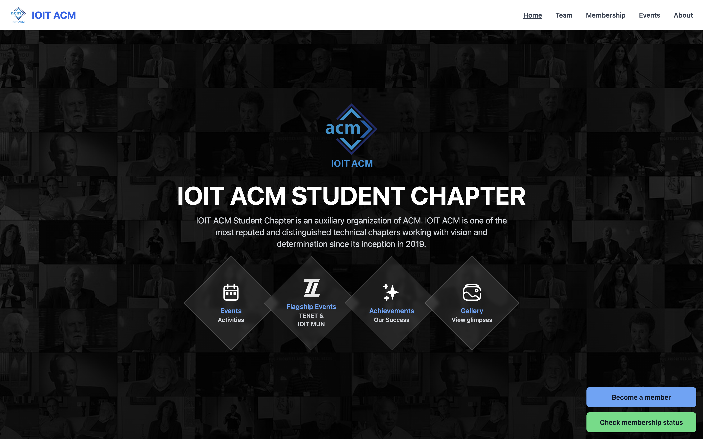
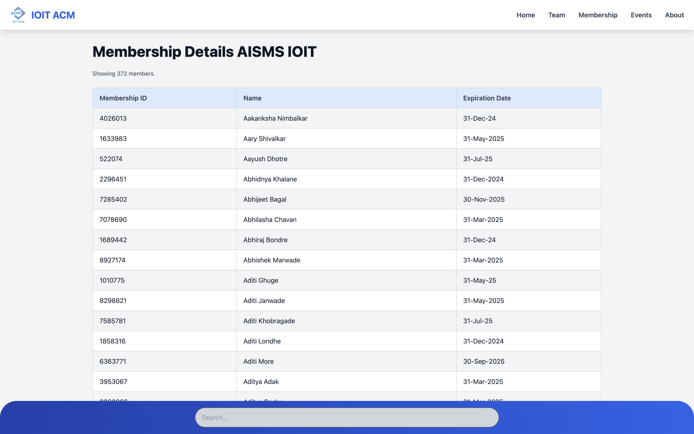

# AISSMS IOIT ACM Student Chapter Flask Project

This is a Flask project for the AISSMS IOIT ACM Student Chapter website.

[Production site](https://ioit.acm.org/)


_Home page_

_Membership Status_

_Footer_

## dependencies

1. Python (v2.7.18)

```
pip install -r requirements.txt
```

2. TailwindCSS (run `npm install`)

```
npx tailwindcss -i ./app/static/css/input.css -o ./app/static/css/tailwind.css --watch
```

## data

1. Teams
   The `app/data/teams.py` file contains information about the members of the AISSMS IOIT ACM committee, organized by year.

2. Events
   The `app/data/events.py` file contains a list of events organized by name, description, and date. Here's the structure:

## Precautions

- **Avoid f-strings:** Use .format() or string concatenation for string interpolation (f-strings are Python 3.6+).

## build.sh

Currently, there is no Git integration in this project. However, the `build.sh` file located in the root directory serves as a utility to copy the necessary project files to a specified destination directory (`$DEST_DIR`). These files can then be zipped and uploaded to cPanel for hosting.

### Instructions:

1. **Set the Destination Directory**
   Modify the `$DEST_DIR` variable in the script to specify the desired location where the project files will be copied.

2. **Make the Script Executable** (Optional)
   To ensure that the script is executable, you can run the following command:

   ```bash
   chmod +x build.sh
   ```

3. **Run the Script**
   After making the script executable, run it with:
   ```bash
   ./build.sh
   ```

## Available Routes

The following routes are available in the project:

- [x] **`/`**: The home page of the site.
- [x] **`/about`**: The about page.
- [x] **`/membership`**: The membership page.
- [x] **`/membership/status`**: A page showing membership status.
- [x] **`/gallery`**: A page (currently under development) displaying images or events.
- [x] **`/team`**: A page with details of the AISSMS IOIT ACM committee members.
- [x] **`/events`**: A page displaying upcoming events.
- [x] **`/events/{event.name}`**: Event details page.

## ACM Membership Data Management

This project manages ACM membership data by integrating with the SheetsDB API and providing a fallback mechanism using a `snapshot.json` file. When the monthly API quota is exceeded, the data is retrieved from the snapshot file.

---

## Overview

### API Integration

The membership data is fetched from SheetsDB using the provided API endpoint and Bearer token. The data is cached for performance, and a fallback JSON file (`snapshot.json`) is used when:

- The API quota is exceeded.
- The API is unavailable due to network or other issues.

### Snapshot File

The `snapshot.json` file is a local backup of the membership data. It should be updated regularly to ensure it reflects the latest data.

To update the snapshot file:

```shell
curl -X GET https://sheetdb.io/api/v1/vn9yo1yzudzoh \
-H "Authorization: Bearer BEARER_TOKEN" > snapshot.json
```

> NOTE: Get the bearer token from the sheetdb console.

## Update data

Python files for data are located in `app/static/data`.

---

### 1. Events (`events.py`)

#### Structure:

- The `events.py` file contains a list of events in the form of dictionaries.
- Each event has the following fields:
  - **`name`**: The title of the event (e.g., "National Level FDP on Cyber Security").
  - **`description`**: A brief overview of the event.
  - **`date`**: The date(s) of the event (e.g., "October 21, 2024 - October 25, 2024").
  - **`image_url`**: A URL to an image representing the event, which can be used for display purposes.
  - **`instagram_link`**: The Instagram link for the event, if available.
  - **`facebook_link`**: The Facebook link for the event, if available.
  - **`topics`**: A list of topics covered during the event.

Example:

```python
events = [
    {
        "name": "National Level FDP on Cyber Security",
        "description": "A faculty development program focused on cyber security topics.",
        "date": "October 21, 2024 - October 25, 2024",
        "image_url": "",
        "instagram_link": "",
        "facebook_link": "",
        "topics": [
            "We discussed the fundamentals of cyber security, including key concepts such as firewalls, encryption, and authentication.",
            "We explored network security techniques to prevent unauthorized access and attacks on computer networks.",
            "We learned about cryptographic methods used to secure communications and protect sensitive information.",
            "We talked about emerging cyber threats like ransomware and phishing, and how to mitigate them using various defense strategies.",
            "We covered risk management approaches to identify vulnerabilities and create robust protection strategies.",
        ],
    },
]
```

#### Usage in the Codebase:

- Events are dynamically rendered in Jinja2 templates via a `for` loop, typically used on event listing or event detail pages.
- The route for each individual event details page is dynamically created using the event’s name as a slug: `/events/{event.name}`. For example, a URL for "National Level FDP on Cyber Security" would be `/events/National%20Level%20FDP%20on Cyber Security`.

#### Precautions:

- **Event name formatting**:

  - Do not use special characters in event names (e.g., `@`, `#`, `&`).
  - Avoid using hyphens (`-`) and slashes (`/`) in event names, as they may conflict with route generation and URL structure.
  - If an event name contains spaces, consider replacing them with underscores (`_`) for compatibility with the URL structure.

- **Image URLs**:
  - Only use appropriate image paths from the `static` folder.
  - If no image is available for an event, leave the `image_url` field empty.

---

### 2. Teams (`teams.py`)

#### Structure:

- The `team_data` variable contains a dictionary with team members categorized by year (e.g., "2024", "2023", "2022").
- Each team entry includes the following fields:
  - **`name`**: The name of the team member.
  - **`title`**: The role or title of the team member (e.g., "Chair", "Vice Chair").
  - **`image`**: The file path to an image of the team member, typically located under `static/img/team/{year}/`.
  - **`linktree`**: A link to the team member's Linktree, if available.
  - **`github`**: The team member's GitHub profile link, if available.
  - **`linkedin`**: The team member's LinkedIn profile link, if available.
  - **`instagram`**: The team member's Instagram profile link, if available.
  - **`domain`**: The domain of work the team member belongs to (e.g., "core", "events", "web", "documentation").

#### Usage in the Codebase:

- This file is used to render team members' information on team-related pages or sections of the website, with each member's details linked to their social media profiles (LinkedIn, GitHub, etc.).
